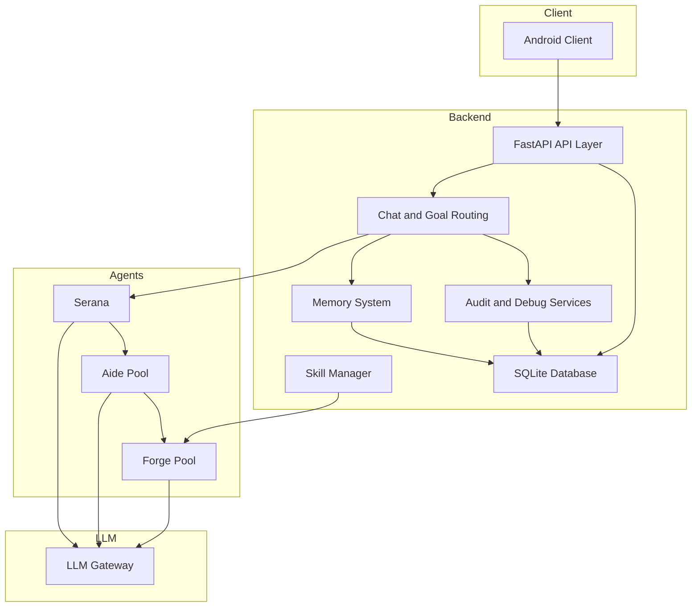

# Serana Architecture

## Overview

Serana is a personal AI assistant system built around a FastAPI backend and a three-layer agent runtime. The current implementation focuses on reliable local operation, traceability, and iterative expansion.

## High-Level Architecture

## Core Backend Layers

### API Layer

The API layer exposes the HTTP surface for:

- chat
- goals
- memory
- agents
- skills
- audit
- LLM configuration

### Agent Layer

The runtime uses three agent roles:

- `Serana`: chief planner and router
- `Aide`: delegated coordinator with classification, batching, and retry behavior
- `Forge`: worker agent with task-type strategy selection

### Memory Layer

The memory subsystem supports:

- profile facts
- history retrieval
- prompt injection for chat and planning

### Audit Layer

The audit subsystem records:

- chat tool traces
- goal lifecycle events
- `Serana` execution steps
- `Aide` and `Forge` execution records

It also exposes filtered audit queries, timelines, summaries, and per-entity debug endpoints.

## Main Runtime Flows

### Chat Flow

1. receive a message
2. load or create a chat session
3. inject memory context
4. analyze complexity through `Serana`
5. either answer directly or delegate through `Aide` and `Forge`
6. persist message traces and audit records
7. expose history, audit, and debug views

### Goal Flow

1. create a goal request
2. plan through `Serana`
3. generate subtasks
4. track lifecycle state
5. delegate execution work when needed
6. store planning summary, thinking traces, and audit records

## Delegation Model

### Complexity Routing

`Serana` decides whether work should stay local or be delegated.

- simple tasks may stay in `direct` mode
- complex tasks move to `delegated` mode

### Pool Limits

Runtime limits are configured in `backend/app/agents/agent_limits.json`:

- `Serana`: 1
- `Aide`: 3
- `Forge`: 5

### Worker Strategy

`Forge` selects execution strategy by task type, for example:

- research
- planning
- analysis
- build
- question
- general

## Storage Model

SQLite is the default local database. The backend persists:

- chat sessions
- messages
- profile facts
- goals and subtasks
- goal events
- audit records
- skill metadata
- LLM configuration

## Observability

The current backend emphasizes local observability:

- structured logs
- stored thinking blocks
- stored tool traces
- entity-specific audit endpoints
- timeline and debug summary APIs

## Known Boundaries

- the project is designed for personal deployment
- the Android client is still catching up to the backend feature set
- lightweight startup migrations are used instead of a formal migration framework

## Related Docs

- [PRD](PRD.md)
- [Development Plan](DEVELOPMENT_PLAN.md)
- [Project Summary](PROJECT_SUMMARY.md)
- [Backend Guide](../backend/README.md)
